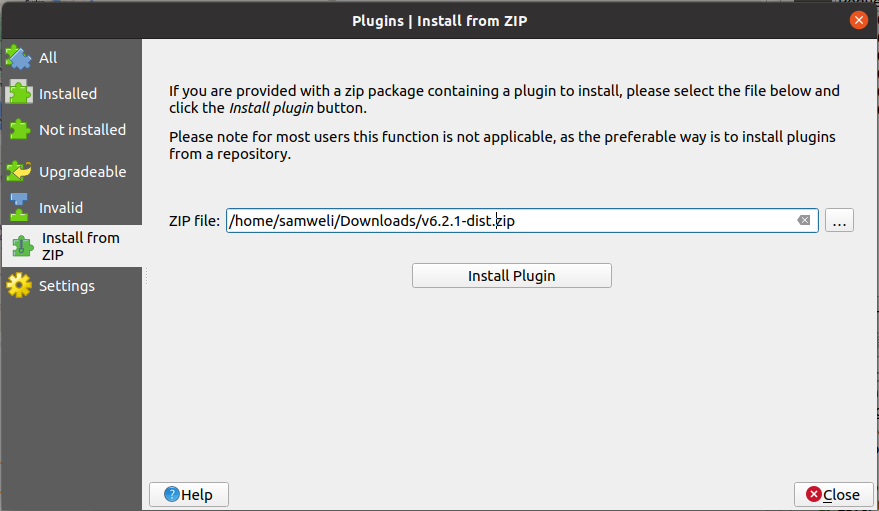

# qgis-stac-plugin
QGIS plugin for reading STAC APIs

### Installation

During the development phase the plugin is available to install via 
a dedicated plugin repository 
https://stac-utils.github.io/qgis-stac-plugin/repository/plugins.xml.

Open the QGIS plugin manager, then select the **Settings** page, click **Add** 
button on the **Plugin Repositories** group box and use the above url for 
the new plugin repository.


After adding the new repository, the plugin should be available from the list
of all plugins that can be installed.

Alternavitely the plugin can be installed using **Install from ZIP** option on the 
QGIS plugin manager. Download zip file from the required plugin released version
https://github.com/stac-utils/qgis-stac-plugin/releases/download/{tagname}/qgis_stac.{version}.zip.

From the **Install from ZIP** page select the zip file and click the **Install** button to install
plugin


When the development work is complete the plugin will be available on the QGIS
official plugin repository.


#### Development 

To use the plugin for development purposes, clone the repository locally,
install poetry, a python dependencies management tool see https://python-poetry.org/docs/#installation
then using the poetry tool, install the plugin dependencies by running 
``` 
poetry update --lock
poetry install
```

To install the plugin into the QGIS application use the below command
```
poetry run python admin.py install
```


